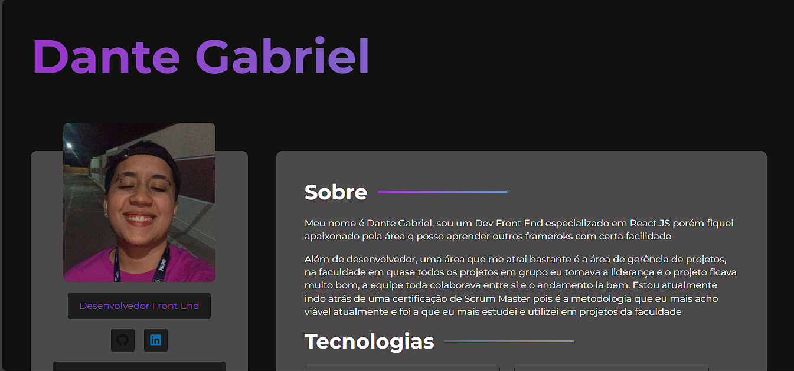

Este é o meu portfolio profissional atualizado para 2024. 

## Tecnologias
As tecnologias que eu utilizei neste projeto foram:
- React.JS
- Npm
- Sass

E para a criação do projeto eu utilizei o Vite.
Para rodar o projeto em sua máquina basta clonar o repositório e o comando do terminal é 
`npm run dev`

Já que este projeto é estático e só tem uma página, não houve necessidade de utilizar o React Router DOM, e por ser simples e não necessitar de tipagem não utilizei TypeScript.

Ainda há coisas na questão do design que eu quero acrescentar e vou atrás de mudar, mas está atualizado. Eu vou adicionando nas issues. 

[O deploy está feito temporariamente em] (https://dantegabrieldev.netlify.app/)
